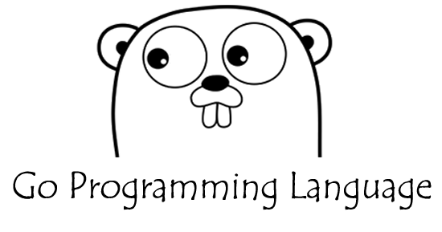

## Starting with GO

Go is a modern programming language developed at Google. It is increasingly popular for many applications and at many companies, and offers a robust set of libraries. 

[Installing Go 1.6 on Ubuntu](https://www.digitalocean.com/community/tutorials/how-to-install-go-1-6-on-ubuntu-16-04)

### Building a simple Hello World application.

Package fmt implements formatted I/O with functions analogous to C's printf and scanf. The format 'verbs' are derived from C's but are simpler.

This will be the code need it to print a simple message in the console

```sh
package main

import "fmt"

func main() {

	fmt.Println("Easy comes easy GO!")

}
```

### Go commands

Usage:
```sh
go command [arguments]
```

The commands are:

build       compile packages and dependencies

clean       remove object files

doc         show documentation for package or symbol

env         print Go environment information

bug         start a bug report

fix         run go tool fix on packages

fmt         run gofmt on package sources

generate    generate Go files by processing source

get         download and install packages and dependencies

install     compile and install packages and dependencies

list        list packages

run         compile and run Go program

test        test packages

tool        run specified go tool

version     print Go version

vet         run go tool vet on packages

### Run, Build and Execute GO file

```sh
go run hello-world.go")
```

```sh
go build hello-world.go")
```

```sh
go run./hello-world")
```